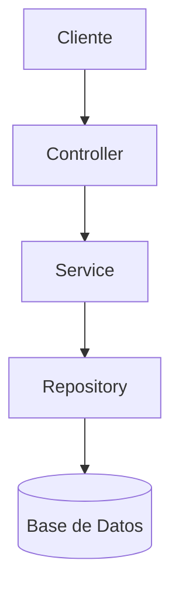
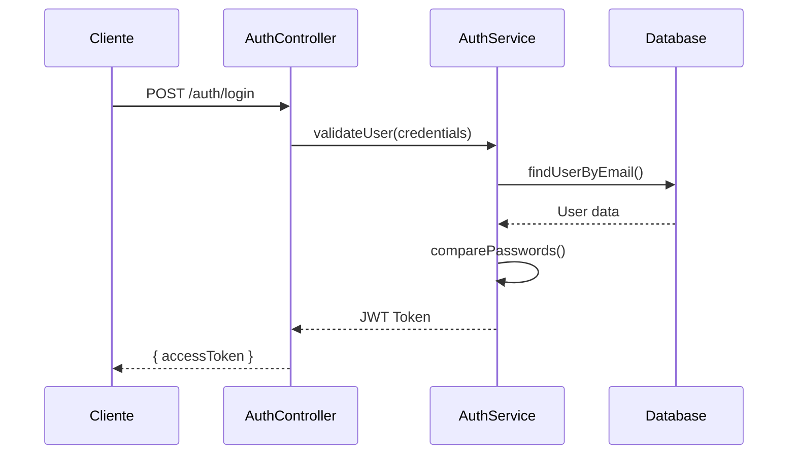
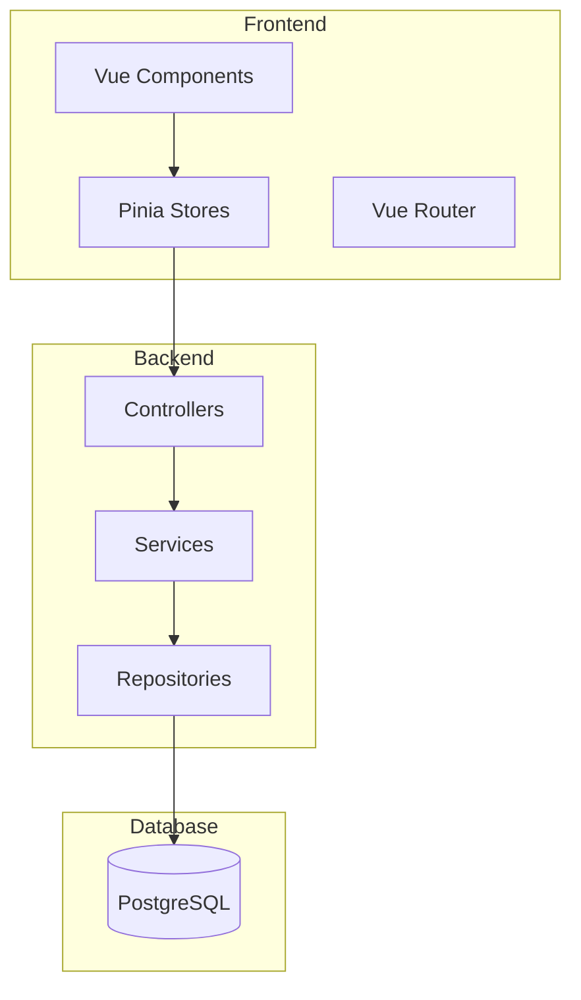

# 📚 Estándares de Documentación

Esta skill define el protocolo para documentar cambios en el proyecto GastosCompartidos. Cada vez que se desarrolle, modifique o refactorice una funcionalidad, se debe actualizar o crear la documentación siguiendo esta estructura.

## 🎯 Principios Fundamentales

1. **Documentación como Código**: La documentación vive junto al código y se actualiza en el mismo PR/commit.
2. **Audiencia Primero**: Identifica claramente si escribes para desarrolladores o usuarios finales.
3. **Ejemplos sobre Teoría**: Cada concepto debe incluir ejemplos concretos del proyecto.
4. **Mantenibilidad**: Prefiere documentación concisa y actualizada sobre documentación exhaustiva pero obsoleta.

## 📁 Estructura de Documentación

```
docs/
├── technical/           # Documentación técnica para desarrolladores
│   ├── architecture/    # Diagramas y decisiones arquitectónicas
│   ├── api/            # Especificaciones de endpoints
│   └── features/       # Documentación por funcionalidad
├── user-guide/         # Guías para usuarios finales
│   ├── getting-started.md
│   └── features/       # Guías de uso por funcionalidad
└── assets/             # Screenshots, diagramas, videos
    ├── screenshots/
    └── diagrams/
```

## 🛠️ 1. Documentación Técnica (Developer-Oriented)

### Ubicación
- **Nueva funcionalidad**: `docs/technical/features/[feature-name].md`
- **API**: `docs/technical/api/[module-name].md`
- **Arquitectura**: `docs/technical/architecture/[decision-name].md`

### Plantilla de Documentación Técnica

```markdown
# [Nombre de la Funcionalidad]

## Resumen
Breve descripción de qué hace esta funcionalidad y por qué existe.

## Arquitectura

### Diagrama de Flujo


### Componentes Involucrados
- **Frontend**: Lista de componentes Vue afectados
- **Backend**: Servicios, controladores, repositorios
- **Base de Datos**: Tablas/entidades modificadas

## API

### Endpoints

#### POST /api/resource
**Descripción**: Breve descripción del endpoint.

**Request Body**:
```typescript
interface CreateResourceDto {
  name: string;
  description?: string;
  status: 'active' | 'inactive';
}
```

**Response**:
```typescript
interface ResourceResponse {
  id: string;
  name: string;
  createdAt: Date;
}
```

**Códigos de Estado**:
- `201`: Recurso creado exitosamente
- `400`: Validación fallida
- `409`: Conflicto (recurso ya existe)

## Lógica de Negocio

### Reglas de Validación
1. El campo `name` debe ser único
2. El campo `status` por defecto es 'active'

### Algoritmos Críticos
Describe cualquier algoritmo complejo con pseudocódigo o ejemplos.

## Modelo de Datos

```prisma
model Resource {
  id          String   @id @default(uuid())
  name        String   @unique
  description String?
  status      Status   @default(ACTIVE)
  createdAt   DateTime @default(now())
  updatedAt   DateTime @updatedAt
}
```

## Testing

### Pruebas Unitarias
```bash
pnpm --filter backend test -- resource.service.spec.ts
```

### Pruebas E2E
```bash
pnpm --filter backend test:e2e -- resource.e2e-spec.ts
```

## Consideraciones de Rendimiento
- Índice en campo `name` para búsquedas rápidas
- Paginación implementada para listados

## Dependencias
- `class-validator`: Para validación de DTOs
- `@nestjs/swagger`: Para documentación de API

## Tareas Pendientes
- [ ] Implementar caché para consultas frecuentes
- [ ] Añadir pruebas de carga
```

### Ejemplos de Diagramas Mermaid

**Flujo de Autenticación**:


**Arquitectura de Módulos**:


## 👤 2. Guía de Usuario (End-User Oriented)

### Ubicación
- `docs/user-guide/features/[feature-name].md`

### Plantilla de Guía de Usuario

```markdown
# [Nombre de la Funcionalidad]

## ¿Qué es?
Explicación simple y directa de qué hace esta funcionalidad.

## ¿Para qué sirve?
Describe el problema que resuelve para el usuario.

## Cómo usar

### Paso 1: [Acción]
Descripción clara del primer paso con captura de pantalla.


### Paso 2: [Acción]
Descripción del segundo paso.

> **💡 Consejo**: Usa el atajo `Ctrl+S` para guardar rápidamente.

### Paso 3: [Resultado]
Qué esperar al finalizar.

## Preguntas Frecuentes

### ¿Por qué no puedo [acción]?
**Respuesta**: Explicación y solución.

### ¿Cómo [tarea específica]?
**Respuesta**: Pasos detallados.

## Solución de Problemas

| Problema | Solución |
|----------|----------|
| Error: "X no está disponible" | Verifica que tengas los permisos necesarios |
| Los cambios no se guardan | Refresca la página y vuelve a intentar |

## Video Tutorial
[Enlace al video tutorial si existe]
```

## 🚀 Flujo de Trabajo Documental

### Durante el Desarrollo

1. **Análisis de Impacto**
   - ¿Afecta la API? → Documentar en `docs/technical/api/`
   - ¿Nueva funcionalidad? → Crear `docs/technical/features/[name].md`
   - ¿Cambio arquitectónico? → Actualizar `docs/technical/architecture/`
   - ¿Interfaz de usuario? → Crear `docs/user-guide/features/[name].md`

2. **Generación Incremental**
   - Escribe la documentación técnica mientras codificas
   - Crea diagramas Mermaid para flujos complejos
   - Añade ejemplos de código TypeScript con tipos

3. **Capturas y Videos**
   - Toma screenshots de cada paso importante en la UI
   - Guárdalos en `docs/assets/screenshots/[feature-name]/`
   - Usa nombres descriptivos: `create-expense-form.png`

### Al Finalizar

4. **Validación**
   - Verifica que todos los enlaces funcionen
   - Asegúrate de que los ejemplos de código compilen
   - Revisa que las rutas de archivos sean correctas

5. **Walkthrough**
   - El `walkthrough.md` debe enlazar a la documentación técnica y de usuario creada
   - Incluye un resumen de los cambios y dónde encontrar más detalles

### Ejemplo de Walkthrough

```markdown
# Implementación de Gestión de Gastos

## Cambios Realizados

Se ha implementado un sistema completo de gestión de gastos compartidos.

### Backend
- Nuevo módulo `expenses` con CRUD completo
- [Documentación técnica completa](../docs/technical/features/expenses-management.md)

### Frontend
- Componentes `ExpenseForm`, `ExpenseList`, `ExpenseDetail`
- [Guía de usuario](../docs/user-guide/features/managing-expenses.md)

## Verificación
- ✅ 24 pruebas unitarias pasando
- ✅ 8 pruebas e2e verificadas
- ✅ Documentación técnica completa
- ✅ Guía de usuario con screenshots
```

## 📊 Checklist de Documentación

Antes de marcar una tarea como completa, verifica:

### Documentación Técnica
- [ ] Diagrama de arquitectura/flujo (Mermaid)
- [ ] Especificación de API (DTOs, endpoints, códigos de estado)
- [ ] Modelo de datos (Prisma schema o interfaces)
- [ ] Lógica de negocio y validaciones
- [ ] Instrucciones de testing
- [ ] Dependencias añadidas/actualizadas

### Documentación de Usuario (si aplica)
- [ ] Propósito claro de la funcionalidad
- [ ] Guía paso a paso con screenshots
- [ ] Sección de preguntas frecuentes
- [ ] Solución de problemas comunes

### Calidad General
- [ ] Sin errores ortográficos
- [ ] Enlaces funcionando
- [ ] Ejemplos de código probados
- [ ] Screenshots actualizados y relevantes

## 🎨 Mejores Prácticas

### Para Diagramas
- Usa colores consistentes (Backend: azul, Frontend: verde, DB: gris)
- Mantén los diagramas simples y enfocados
- Actualiza diagramas cuando cambie la arquitectura

### Para Ejemplos de Código
- Usa TypeScript con tipos completos
- Incluye imports necesarios
- Muestra casos de uso reales del proyecto

### Para Screenshots
- Resolución mínima: 1280x720
- Formato: PNG para UI, SVG para diagramas
- Añade anotaciones/flechas para destacar elementos importantes

## 🔄 Mantenimiento

### Revisión Trimestral
- Revisa y actualiza documentación obsoleta
- Elimina documentación de funcionalidades deprecadas
- Consolida documentación fragmentada

### En Cada Release
- Actualiza el changelog
- Verifica que la documentación de API esté sincronizada con Swagger
- Actualiza screenshots si la UI cambió significativamente
